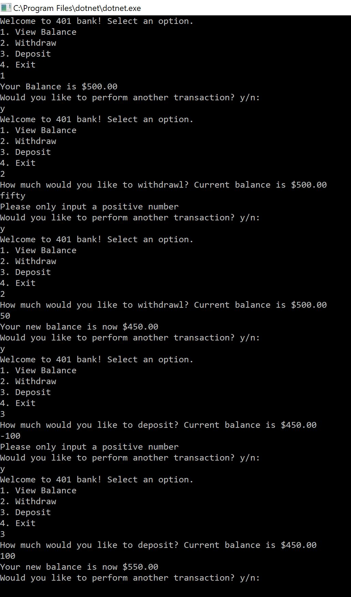

# Lab02-ATM
This repo holds a console application that simulates a bank ATM with the ability to check, withdraw, and deposit balance.

## How to use it
1. Clone this repo
2. Open bankATM project in Visual Studio
3. "Start" application inside visual studio, this will open a console of the app
4. Interact with the app using the console and follow instructions.

## Visual
